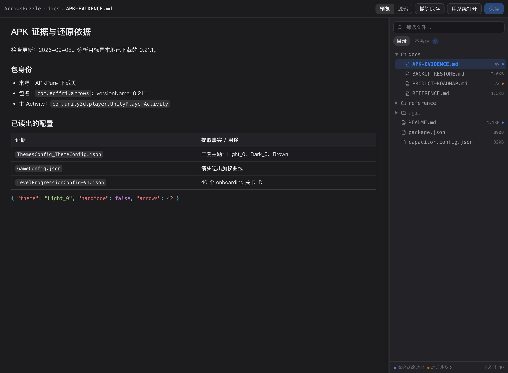
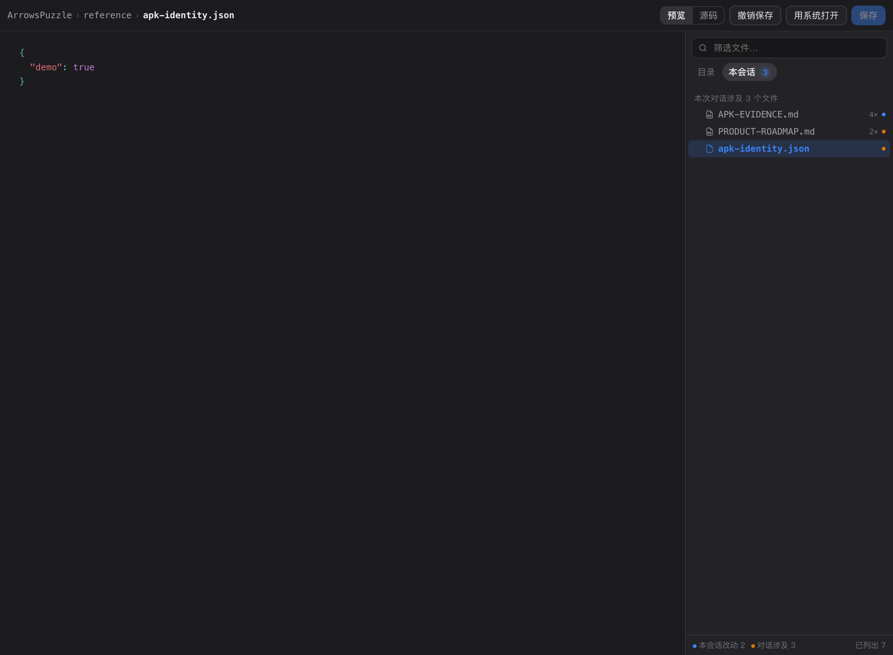
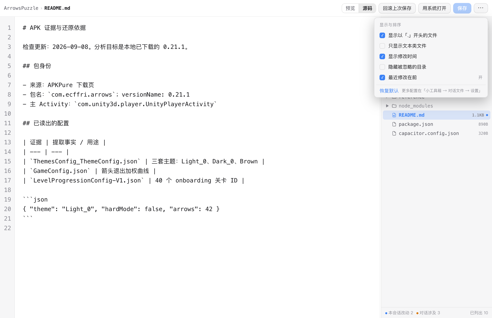

# 对话文件 · Finch Session Files


在**当前对话绑定的文件夹**里浏览、预览和就地修改文件 —— 不用离开会话，也不用切到别的编辑器。

给 [Finch](https://finchwork.app) 用的一个小程序（mini tool）：右侧面板多一个「对话文件」入口 —— 左边看文件（Markdown 渲染 / 代码高亮，可切源码编辑并保存），右边是这个目录的文件树（可搜索、可点击）。Composer 工具栏也多一个按钮，一键打开。



MIT · 不联网 · 不执行 shell · 不读密钥

## 为什么需要它

跟 AI 干活的产物 —— 报告、方案、脚本、生成的图片 —— 都落在对话绑定的目录里。要回看某一份，得切到访达或者别的编辑器；想顺手改一行，还得再回来。这个小程序把「这个对话的目录」直接搬到对话旁边。

## 安装

**从 GitHub 装**（打包产物已随仓库提交，不需要自己构建）：

```bash
npx @finchtoys/minitools add https://github.com/zhaobaizhou/finch-file-browser/archive/refs/heads/main.zip
```

**从本地源码装**（改代码时用这个）：

```bash
git clone https://github.com/zhaobaizhou/finch-file-browser.git
cd finch-file-browser
npm install
npm run build
npx @finchtoys/minitools add . -d      # -d 装成符号链接，改完源码重跑 build 即可
```

装完在 Finch 的「小工具箱」里启用，首次会请求**文件读写权限**。

## 功能

### 右栏 · 文件树

- 点击展开目录（懒加载，大目录不吃内存）
- 按路径筛选（清空搜索框恢复树视图）
- `.git`、`node_modules`、`dist` 等默认弱化显示，仍可展开
- 按目录分组排序、目录优先、数字自然序

### 左栏 · 阅读与编辑

| 类型 | 行为 |
|---|---|
| Markdown | 渲染正文 ⇄ 源码切换，表格、任务列表、代码块高亮 |
| 代码 / 纯文本 | 语法高亮预览 ⇄ 源码编辑（自动识别语言） |
| 图片 | 内嵌预览 |
| Word / Excel / PDF 等 | 给一张卡片，一键交给系统默认程序打开 |

顶部面包屑显示当前文件相对这个文件夹的完整路径。

### 编辑与保存

- `⌘S` / `Ctrl+S` 或「保存」按钮写回原文件
- 保存前校验磁盘 mtime：如果文件在你编辑期间被 Agent 改过，会弹提示，让你选**以我的版本覆盖**或**先重新载入**
- **回滚上次保存**：每次保存前会把上一版内容存进小程序私有目录，可以原地回滚到保存前的状态（一次性，回滚后按钮自动变灰）
- 切换文件时若有未保存改动会先确认

### 改动高亮与自动刷新

- 🔵 蓝点 = 本次对话开始后被创建或修改过的文件
- 🟠 橙点 = 出现在本次对话中的文件（被读过、被提到过）
- 面板开着时 Agent 一改文件，右栏自动刷新（`fs.watch`）
- 当前打开的文件被外部修改：没有本地改动就直接重载，有本地改动则提示你选择

### 「本会话」标签页

一趟对话下来碰过的文件全在这里，带命中次数，点一下直接打开 —— 这是「AI 刚写的那份报告在哪」最快的答案。



### 右键菜单

- 打开 / 用系统程序打开 / 在访达中显示
- 复制绝对路径 / 复制相对路径
- **插入到对话** —— 把该文件作为引用塞进输入框，接着跟 AI 说「改一下这个」

## 配置

配置分两层，**两层都能用**：

**① 面板里的快捷开关**（右上角 `⋯`）—— 随手切、即时生效、不重载小程序：

- 显示以「.」开头的文件（**默认关**，所以 `.git`、`.gitignore`、`.trash` 默认不出现）
- 只显示文本类文件
- 显示修改时间
- 隐藏被忽略的目录
- 最近修改在前（排序）

在面板里改过的项会带一个蓝点标记，点「恢复默认」一键清掉。

**② 原生设置页**（小工具箱 → 对话文件 → 设置）—— 存长期默认值：

| 设置 | 默认 | 说明 |
|---|---|---|
| `showHidden` | 关 | 显示以「.」开头的文件与文件夹 |
| `textOnly` | 关 | 隐藏图片与二进制，只留文本类 |
| `hideIgnoredFolders` | 关 | 从树里移除被忽略的目录，而不只是灰显 |
| `ignoreFolders` | `node_modules` `dist` `build` `out` `target` `coverage` `__pycache__` `.venv` | 一行一个，扫描和搜索时跳过 |
| `sortOrder` | 按名称（目录优先） | 或「最近修改在前」 |
| `showModTime` | 关 | 每行显示修改时间 |
| `scanLimit` / `scanDepth` | 8000 / 10 | 后台扫描上限，防超大目录卡顿 |
| `markdownView` | 渲染预览 | 或直接用源码编辑器打开 |
| `codeFontSize` | 0 | 源码区字号，0 = 跟随 Finch |
| `wrapLongLines` | 关 | 源码区自动换行 |
| `showLineNumbers` | 关 | 源码区显示行号 |
| `externalChange` | 自动重新载入 | 或「总是先问我」 |



**优先级**：面板快捷开关 → 原生设置页 → 内置默认值。需要这一层覆盖，是因为保存原生设置页会**重载小程序**，对「随手切一下」太重。

## 它是怎么工作的

**这个文件夹是哪来的**：优先用该对话所属 Space 绑定的目录，否则用对话的工作目录（cwd）。

**「本会话碰过哪些文件」怎么算的**：只读解析 Finch 本地的会话转录（`~/.finch/pi/sessions/**/<sessionId>.jsonl`）—— 提取每个工具调用里出现、且**在磁盘上真实存在**的路径，再做一次存在性校验，所以过期引用不会变成幽灵条目。会话开始时间也来自同一份文件。

转录读不到时自动降级：改动高亮退化为空，「本会话」列表退化为空，浏览和编辑完全不受影响。

**编辑安全网**：保存前记录 mtime 做冲突检测，保存前落一份备份用于回滚。所有路径都经过 `resolveInside()` 守卫，任何试图逃出当前文件夹的路径（`../`、绝对路径）都会被拒绝。

## 权限

| 权限 | 用途 |
|---|---|
| `filesystem: readwrite` | 读目录、读文件、写回文件 |
| `network` | ❌ 不使用 |
| `shell` | ❌ 不使用（仅在 macOS 上调用系统 `open` 来「用系统程序打开」/「在访达中显示」） |
| `secrets` | ❌ 不使用 |

## 项目结构

```
src/index.ts     宿主侧：目录扫描、读写、会话转录解析、文件监听、面板消息路由
src/panel.html   面板页面
src/panel.css    样式（全部走 Finch 主题变量，自动跟随浅色/深色皮肤与字号设置）
src/panel.js     面板逻辑（marked + highlight.js + DOMPurify）
src/paths.ts     路径守卫、扩展名分类、忽略规则
src/session.ts   会话转录解析（开始时间、cwd、涉及的文件）
scripts/smoke.ts 后端逻辑冒烟测试（可跑真实转录）
docs/icon.svg    图标源文件（`npm run icon` 需要 rsvg-convert）
```

### 开发命令

```bash
npm run typecheck   # tsc --noEmit
npm run build       # 宿主 + 页面 + 静态资源
npm run doctor      # npx @finchtoys/minitools doctor .
npm run icon        # 重新生成 icon.png
```

`dist/` 是构建产物，但**刻意随仓库提交** —— 这样 `add <archive.zip>` 这种直接从 GitHub 安装的方式不需要用户自己构建。改完源码记得跑 `npm run build` 再提交。

调试页面本身很方便：`dist/panel.html` 在没有 `window.finch` 时（例如直接用浏览器打开）会退回到一份内置演示数据，可以单纯调样式；在 Finch 里永远走真实 Bridge。

## 已知边界

- 对话正文里出现的文件路径**不会**变成可点击链接 —— 时间线由 Finch 主程序渲染，小程序 API 没有注入入口。本工具的替代方案是「本会话」标签页 + 右键「插入到对话」。
- 会话转录的路径与格式属于 Finch 内部实现，未来版本若有变化，相关功能会自动降级（不影响浏览和编辑）。
- 二进制文件不在面板内渲染，只提供「用系统程序打开」。
- 界面文案目前为简体中文。
- 原生设置页里 `select` 下拉的**选项标签**本地化，用的是 `i18n/zh-CN.json` 里 `settings.fields.<key>.options` 的嵌套写法。这一形状没有官方先例可参考（官方文档只说明「支持 select option labels」），如果下拉里显示的还是英文，属于这一处；其余字段的标签与说明走的是官方验证过的路径。欢迎提 issue。

## English

A Finch mini tool that puts the current conversation's folder next to the conversation: a file tree on the right (searchable, lazily loaded), a preview/editor on the left (Markdown rendering, syntax highlighting, in-place editing with save + one-step rollback), plus change highlighting for files this session created or touched.

Install:

```bash
npx @finchtoys/minitools add https://github.com/zhaobaizhou/finch-file-browser/archive/refs/heads/main.zip
```

It never uses the network, never runs shell commands, and declares only `filesystem: readwrite`. Local-only: all file access stays on your machine.

## License

[MIT](LICENSE)
